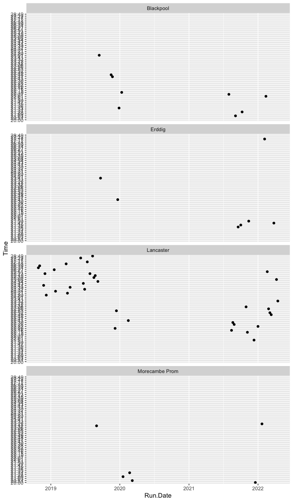

Parkrun Results
================

``` r
url_data <- "https://www.parkrun.org.uk/parkrunner/5076650/all/"
```

``` r
read_html('results | parkrun UK.html') %>%
  html_nodes(xpath='//*[@id="results"]') %>%
  html_table() -> Results

write.csv(Results[3], 'AllResults.csv')
```

``` r
read.csv('AllResults.csv') %>%
  mutate(Run.Date = dmy(Run.Date)) %>%
  group_by(Event) %>% filter(n() > 4) -> TidyResults

TidyResults
```

    ## # A tibble: 57 × 8
    ## # Groups:   Event [4]
    ##        X Event          Run.Date   Run.Number   Pos Time  AgeGrade PB.  
    ##    <int> <chr>          <date>          <int> <int> <chr> <chr>    <chr>
    ##  1     2 Lancaster      2022-04-16        254    23 23:32 54.82%   ""   
    ##  2     3 Lancaster      2022-04-09        253    34 25:08 51.33%   ""   
    ##  3     5 Erddig         2022-03-26        203     8 21:47 59.22%   ""   
    ##  4     6 Lancaster      2022-03-12        249    13 22:49 56.54%   ""   
    ##  5     7 Lancaster      2022-03-05        248    17 22:52 56.41%   ""   
    ##  6     8 Lancaster      2022-02-26        247    22 22:56 56.25%   ""   
    ##  7     9 Lancaster      2022-02-19        246    45 25:51 49.90%   ""   
    ##  8    10 Blackpool      2022-02-12        186    13 22:01 58.59%   ""   
    ##  9    11 Erddig         2022-02-05        197    58 27:17 47.28%   ""   
    ## 10    12 Morecambe Prom 2022-01-22         77    64 23:22 55.21%   ""   
    ## # … with 47 more rows

``` r
TidyResults %>%
  ggplot(aes(x = Run.Date, y = Time)) + 
  geom_point() +
  facet_wrap(~Event, ncol = 1)
```

<!-- -->
